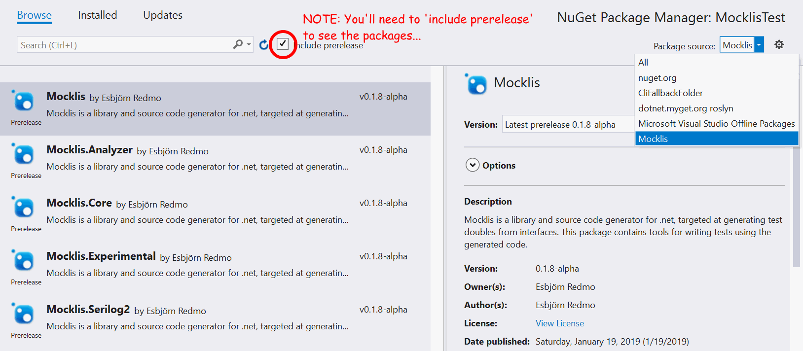

============
Installation
============

The quick version
-----------------

Add the ``Mocklis`` nuget package to your test project.

This can be done with the NuGet browser in Visual Studio: Search for 'Mocklis' while on the Browse tab, and you should see the Mocklis
packages and be able to add ``Mocklis`` to your project.

You'll need to tick the checkbox that says 'Include prerelease' to see the ``Mocklis.Experimental`` package.

The slighly longer version
--------------------------

There are two things that you'll need to get hold of to run Mocklis.

Firstly there is a code generator that builds test double classes from interface definitions. The recommended way is to use a
Roslyn Analyzer + Code Fix supplied in the form of the NuGet package ``Mocklis.MockGenerator``. (If you're building Mocklis
from sources - kudos if you do - there is an embryo to a command-line version. This is just the absolute bare minimum needed to
load a solution and update all MocklisClasses within.)

Then there is a library of pluggable 'steps' which provide bite-sized behaviours to the test doubles, along with some supporting
code. This library is spread over a number of assemblies, most notably ``Mocklis.Core`` which contains the minimum amount of code
required to build the test doubles, and ``Mocklis`` which you use in your tests to add behaviour. There's also ``Mocklis.Experimental``
for steps whose design is still under development (read: steps that simply haven't been axed yet...) and ``Mocklis.Serilog2`` which
contains a logging provider for Serilog 2.x.

Note that ``Mocklis.Experimental`` is going to stay a perpetual 0.x pre-release, so that it can have breaking changes without violating
the semantic versioning rules.
