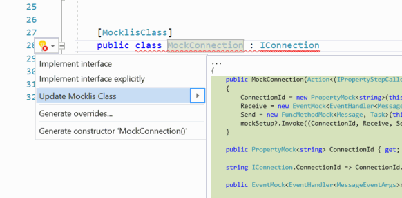
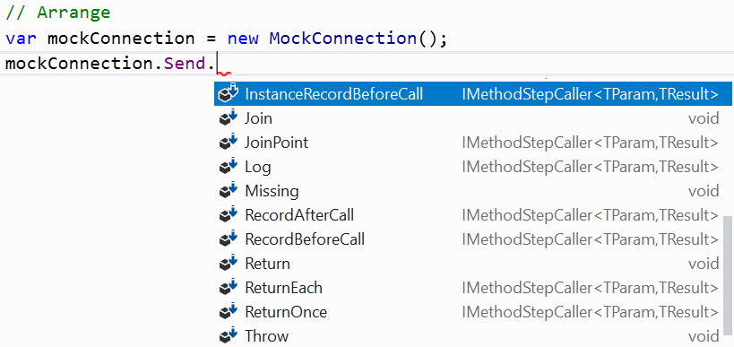

============
Introduction
============

Mocklis is a mocking library for .net (currently C# only) that

* Creates fake implementations of interfaces,
* that can be given specific behaviour,
* in an intellisense-friendly way,
* to be handed as dependencies for components we want to test,
* and verify that they are correctly interacted with,
* without any use of reflection.

Let's go over these points one by one.

Fake implementations of interfaces
==================================

With Mocklis you take an interface that defines a dependency for a component we wish to test:

.. sourcecode:: csharp

    public interface IConnection
    {
        string ConnectionId { get; }
        event EventHandler<MessageEventArgs> Receive;
        Task Send(Message message);
    }

Then you create an empty class implementing this interface, decorated with the ``MocklisClass`` attribute.

.. sourcecode:: csharp

    [MocklisClass]
    public class MockConnection : IConnection
    {
    }

This will of course not compile in its current form. However, the presence of the ``MocklisClass`` attribute enables a code fix in Visual Studio.

The code fix replaces the contents of the class as follows:

.. sourcecode:: csharp

    [MocklisClass]
    public class MockConnection : IConnection
    {
        // The contents of this class were created by the Mocklis code-generator.
        // Any changes you make will be overwritten if the contents are re-generated.

        public MockConnection()
        {
            ConnectionId = new PropertyMock<string>(this, "MockConnection", "IConnection", "ConnectionId", "ConnectionId", Strictness.Lenient);
            Receive = new EventMock<EventHandler<MessageEventArgs>>(this, "MockConnection", "IConnection", "Receive", "Receive", Strictness.Lenient);
            Send = new FuncMethodMock<Message, Task>(this, "MockConnection", "IConnection", "Send", "Send", Strictness.Lenient);
        }

        public PropertyMock<string> ConnectionId { get; }

        string IConnection.ConnectionId => ConnectionId.Value;

        public EventMock<EventHandler<MessageEventArgs>> Receive { get; }

        event EventHandler<MessageEventArgs> IConnection.Receive {
            add => Receive.Add(value);
            remove => Receive.Remove(value);
        }

        public FuncMethodMock<Message, Task> Send { get; }

        Task IConnection.Send(Message message) => Send.Call(message);
    }

You can see that the ``IConnection`` interface has been explicitly implemented, where the ``IConnection.ConnectionId`` property gets its value
from a `mock property` with the same name. The ``IConnection.Receive`` event forwards adds and removes to another `mock property`, and the
``IConnection.Send`` method forwards calls to yet another `mock property`.

Note that the `mock properties` are always properties even if the members they support aren't: the ``IConnection.Send`` method is paired with a `mock property`
of type ``FuncMethodMock``, the ``IConnection.Receive`` event is paired with a `mock property` of type ``EventMock`` and so forth.

The practical upshot is that the ``IConnection`` interface is now implemented by the class, so that instances of the class can be used in places where
the ``IConnection`` interface is expected.

Can be given specific behaviour
===============================

If we just use the class that was written for us in a real test it might not work as expected. The default behaviour for a newly
constructed `mock property` is to return default values for any out/ref parameters and return values from methods, indexers or properties.

`Mocklis classes` are 'lenient' by default in the sense that without configuration, they will not get in your way but may also not provide you with anything useful.

You can opt-in to making your mocks stricter, so that they will throw an exception when missing configuration. This is done by adding `Strict = true` to your ``MocklisClass``
attribute.

.. sourcecode:: csharp

    [MocklisClass(Strict = true)]
    public class MockConnection : IConnection
    {
        // The contents of this class were created by the Mocklis code-generator.
        // Any changes you make will be overwritten if the contents are re-generated.

        public MockConnection()
        {
            ConnectionId = new PropertyMock<string>(this, "MockConnection", "IConnection", "ConnectionId", "ConnectionId", Strictness.Strict);
            Receive = new EventMock<EventHandler<MessageEventArgs>>(this, "MockConnection", "IConnection", "Receive", "Receive", Strictness.Strict);
            Send = new FuncMethodMock<Message, Task>(this, "MockConnection", "IConnection", "Send", "Send", Strictness.Strict);
        }

        public PropertyMock<string> ConnectionId { get; }

        string IConnection.ConnectionId => ConnectionId.Value;

        public EventMock<EventHandler<MessageEventArgs>> Receive { get; }

        event EventHandler<MessageEventArgs> IConnection.Receive {
            add => Receive.Add(value);
            remove => Receive.Remove(value);
        }

        public FuncMethodMock<Message, Task> Send { get; }

        Task IConnection.Send(Message message) => Send.Call(message);
    }

Now instead of doing nothing and returning a bare minimum, the use of any mock would throw an exception instead, something like:

.. sourcecode:: none

    Mocklis.Core.MockMissingException : No mock implementation found for adding a handler to Event 'IConnection.Receive'. Add one using 'Receive' on your 'MockConnection' instance.

Of course just doing nothing or throwing an exception doesn't help us write good tests. `Mocklis classes` are given specific behaviour using 'steps', small pieces of functionality
that are added to the `mock properties`, and can be chained together to cater for more advanced use cases.

The default behaviour is identical to what you would get with the ``Missing`` step.
The next step up (pun very much not intended) from this is the ``Dummy`` step: don't do anything, but also don't throw exceptions and use
`default` as a return value whenever one is asked for. The test that caused the error above could be mended using this ``Dummy`` step as follows:

.. sourcecode:: csharp

    [Test]
    public void CanCreatePingService()
    {
        // Arrange
        var mockConnection = new MockConnection();
        mockConnection.Receive
            .Log()
            .Stored(out var registeredEvents);

        // Act
        var pingService = new PingService(mockConnection);

        // Assert
        Assert.IsNotNull(pingService);
    }

The ``Stored`` step which will keep track of attached event handlers (and allow us to raise events on these handlers
if we wish to do so), and there are a number of other steps with other types of attachable behaviours.

This chapter is just an introduction; see the reference for a complete list of steps and other constructs used to tune how `Mocklis Classes` work.

Intellisense friendly
=====================

Intellisense is a great feature of modern code editors, and Mocklis is written to make the most of it. Your `Mocklis class` exposes `mock properties`
for members of implemented interfaces. These `mock properties` have extension methods for all of the different steps that they support, which allows
Visual Studio will list the available steps through intellisense.

Thanks to the extension method approach this list would also include any bespoke steps that have been added, whether defined in your own
solution or in third party packages.

When mocking out method calls, all arguments are combined into a named value tuple (unless there's exactly one in which case that one is used),
which means that we get intellisense for using those parameters as well.

.. image:: intellisense2.png

Used as dependencies
====================

Since `Mocklis classes` implement interfaces explicitly, we don't risk a name clash with the `mock properties` (and indeed if possible, the `mock properties`
will be given the same name as the interface member it's paired with), and we can use the `Mocklis class` instance directly wherever the
interface is expected.

`Mocklis classes` can also implement more than one interface in cases where the component it acts as a stand-in for would implement more than
one interface. Common cases include where a class would implement a service interface and ``IDispose``, or an interface with property accessors
and ``INotifyPropertyChanged``. If you need to mock out an enumerable, your `Mocklis class` can mock both ``IEnumerable<T>`` and ``IEnumerator<T>``
at the same time.

However, this also means that `Mocklis classes` can not create mocks for virtual members of an (abstract) base class, as these can not be explicitly implemented.

Verify interactions
===================

There are a number of ways in which you can verify that the 'component under test' makes the right calls to your mocked dependency. The most
basic way is to not add any steps for code that you don't wish to be called. If called, these will throw a ``MockMissingException`` which
(hopefully) will bubble up through the tested code and fail the test.

If you want to throw a different exception than ``MockMissingException`` you can use the ``Throw`` step.

Mocklis also has a small set of verification classes and interfaces that can be used to add checks to your `mock properties` and to verify
the contents of ``Stored`` steps.

Take for instance this, somewhat contrived (not to mention suspiciously self-contained) test:

.. sourcecode:: csharp

    [Fact]
    public void TestIndex()
    {
        // Arrange
        var vg = new VerificationGroup("Checks for indexer");
        var mockIndex = new MockIndex();
        mockIndex.Item
            .ExpectedUsage(vg, null, 1, 3)
            .StoredAsDictionary()
            .CurrentValuesCheck(vg, null, new[]
            {
                new KeyValuePair<int, string>(1, "one"),
                new KeyValuePair<int, string>(2, "two"),
                new KeyValuePair<int, string>(3, "thre")
            });

        var index = (IIndex) mockIndex;

        // Act
        index[1] = "one";
        index[2] = "two";
        index[3] = "three";

        // Assert
        vg.Assert(includeSuccessfulVerifications: true);
    }

This test will fail with the following output:

.. sourcecode:: none

    Mocklis.Verification.VerificationFailedException : Verification Failed.

    FAILED: Verification Group 'Checks for indexer':
    FAILED:   Usage Count: Expected 1 get(s); received 0 get(s).
    Passed:   Usage Count: Expected 3 set(s); received 3 set(s).
    FAILED:   Values check:
    Passed:     Key '1'; Expected 'one'; Current Value is 'one'
    Passed:     Key '2'; Expected 'two'; Current Value is 'two'
    FAILED:     Key '3'; Expected 'thre'; Current Value is 'three'

Note that all verifications are checked - it will not stop at the first failure. By default the assertion
will not show the Passed verifications (although the exception itself has a VerificationResult property,
so you can always get to it). If you want to include all verifications in the exception message you need
to pass true for the ``includeSuccessfulVerifications`` parameter, as was done in the sample above.

Without reflection
==================

Maybe this point should have gone in first. Mocklis does not use reflection to find out information
about mocked interfaces, and it does not use emit or dynamic proxies to add implementations on the fly.
There are pros and cons with this approach:

Pros
----

* What you see is what you get. No code is hidden from view, and you can freely set break points and inspect variables as you're debugging your tests.

* You can easily extend Mocklis with your own steps, with whatever bespoke behaviour you might need.

* The running of your tests is significantly faster than they would have been with on-the-fly generated dynamic proxies.

Cons
----

* Your project will include code for mocked interfaces, although that code can be reused by all tests using the interface.

* The code in question has to be written, although the code generator bundled with Mocklis makes this much easier.

* We can only only mock interfaces; not virtual base classes. This could potentially be changed down the line, but it would make code generation a little bit harder (need to make sure there are no name clashes) and it is not felt to be that common a thing to do.

