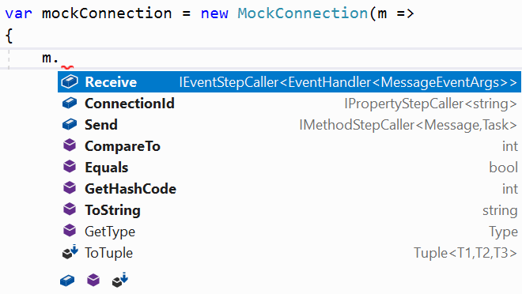
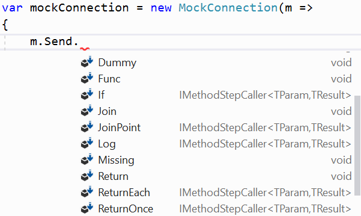

============
Introduction
============

Mocklis is a mocking library for .net (currently C# only) that

* Creates fake implementations of interfaces,
* that can be given specific behaviour,
* in an intellisense-friendly way,
* to be handed as dependencies for components we want to test,
* and verify that they are correctly interacted with,
* without any use of reflection.

Let's go over these points one by one.

Fake implementations of interfaces
==================================

With Mocklis you take an interface that defines a dependency for a component we wish to test:

.. sourcecode:: csharp

    public interface IConnection
    {
        string ConnectionId { get; }
        event EventHandler<MessageEventArgs> Receive;
        Task Send(Message message);
    }

Then you create an empty class implementing this interface, decorated with the ``MocklisClass`` attribute.

.. sourcecode:: csharp

    [MocklisClass]
    public class MockConnection : IConnection
    {
    }

This will of course not compile in its current form. However, the MocklisClass attribute enables a refactoring action in Visual Studio.

.. image:: UpdateMocklisClass.png

*At the moment, this is all the MocklisClass attribute does. It's possible that it may add other instructions to the code generator
in the future but for now this is it.*

When this refactoring is used, the contents of the class is replaced with something like the following:

.. sourcecode:: csharp

    [MocklisClass]
    public class MockConnection : IConnection
    {
        public MockConnection(Action<(
            IPropertyStepCaller<string> ConnectionId,
            IEventStepCaller<EventHandler<MessageEventArgs>> Receive,
            IMethodStepCaller<Message, Task> Send)> mockSetup = null)
        {
            ConnectionId = new PropertyMock<string>(this, "MockConnection", "IConnection", "ConnectionId", "ConnectionId");
            Receive = new EventMock<EventHandler<MessageEventArgs>>(this, "MockConnection", "IConnection", "Receive", "Receive");
            Send = new FuncMethodMock<Message, Task>(this, "MockConnection", "IConnection", "Send", "Send");
            mockSetup?.Invoke((ConnectionId, Receive, Send));
        }

        public PropertyMock<string> ConnectionId { get; }

        string IConnection.ConnectionId => ConnectionId.Value;

        public EventMock<EventHandler<MessageEventArgs>> Receive { get; }

        event EventHandler<MessageEventArgs> IConnection.Receive {
            add => Receive.Add(value);
            remove => Receive.Remove(value);
        }

        public FuncMethodMock<Message, Task> Send { get; }

        Task IConnection.Send(Message message) => Send.Call(message);
    }

You can see that the ``IConnection`` interface has been implicitly implemented, where the ``IConnection.ConnectionId`` property gets its value
from a `Mock Property` with the same name, and that the same goes for the ``IConnection.Receive`` event and the ``IConnection.Send`` method.

*Note that the Mock Properties are always properties even if the members they support aren't: the Send method is paired with a Mock Property
of type FuncMethodMock, the Receive event is paired with a Mock Property of type EventMock and so forth.*

Instances of the class can now be used in places where the ``IConnection`` interface is expected.

Can be given specific behaviour
===============================

If we just use the class that was writter for us in a real test, the test would almost certainly fail. The default behaviour for a newly
constructed `Mock Property` is to throw an exception, such as:

``Mocklis.Core.MockMissingException : No mock implementation found for adding handler to Event 'IConnection.Receive'. Add one using 'Receive' on the 'MockConnection' class.``

Mocklis classes are 'strict' mocks in the sense that without configuration, they will not try to help you out; all calls to the mock instance will
throw a `MockMissingException`.

Mocklis classes are given specific behaviour using 'steps', small pieces of functionality that are added to the Mock Properties, and can be
chained together to cater for more advanced use cases. The default behaviour is identical to what you would get with the 'Missing' step.
The next step up (pun very much not intended) from this is the 'Dummy' step: don't do anything, but also don't throw exceptions and use
`default` as a return value whenever one is asked for. The test that caused the error above could be mended using this 'Dummy' step as follows:

.. sourcecode:: csharp

    [Test]
    public void CanCreatePingService()
    {
        // Arrange
        var mockConnection = new MockConnection(m =>
        {
            m.Receive.Dummy();
        });
        
        // Act
        var pingService = new PingService(mockConnection);

        // Assert
        Assert.IsNotNull(pingService);
    }

The next step up from 'Dummy', if we actually need to remember what event handlers were actually added to the event is the `Stored` step, which
will keep track of attached event handlers, and there are a number of other steps with other types of attachable behaviours.

Intellisense friendly
=====================

Intellisense is a great feature of modern code editors, and Mocklis is written to make the most of it. There are in particular two places where
Mocklis tries to help you out. Firstly the constructor gives you an `Action` with a value tuple giving access to all Mock properties on the
class.

Then when one of these is selected, you get suggestions for steps that can be applied.

Since Mocklis uses extension methods to apply steps to Mock Properties, this list would also include any bespoke steps that have been added, 
and the intellisense support would work equally well if just selecting a Mock Property on the Mocklis class instance directly and added a
dot for method invocation.

Used as dependencies
====================

Since Mocklis classes implement interfaces implicitly, we don't risk a name clash with the Mock Properties (and indeed if possible, the Mock
Properties will be given the same name as the interface member it's paired with), and we can use the Mock instance directly wherever the
interface is expected.

Mocklis classes can also implement more than one interface in cases where the component it acts as a stand-in for would implement more than
one interface. Common cases include where a class would implement a service interface and `IDispose`, or an interface with property accessors
and `INotifyPropertyChanged`. If you need to mock out an enumerable, your Mocklis class can mock both `IEnumerable<T>` and `IEnumerator<T>`
at the same time.

However, this also means that Mocklis classes can not derive from an existing class and create mocks for virtual members.

Verify interactions
===================

There are a number of ways in which you can verify that the 'component under test' makes the right calls to your mocked dependency. The most
basic way is to not add any steps for code that you don't wish to be called. If called, these will throw a ``MockMissingException`` which
(hopefully) will bubble up through the tested code and fail the test.

If you want to throw a different exception than ``MockMissingException`` you can use the ``Throw`` step.

Mocklis also has a small set of verification classes and interfaces that can be used to add checks to your `Mock Properties` and to verify
the contents of `Stored` steps.

Take for instance this, somewhat contrived, test:

.. sourcecode:: csharp

    [Test]
    public void TestIndex()
    {
        // Arrange
        VerificationGroup vg = new VerificationGroup("Checks for indexer");
        IIndex mockIndex = new MockIndex(m =>
        {
            m.Item
                .ExpectedUsage(vg, null, 1, 3)
                .StoredAsDictionary()
                .CurrentValuesCheck(vg, null, new[]
                {
                    new KeyValuePair<int, string>(1, "one"),
                    new KeyValuePair<int, string>(2, "two"),
                    new KeyValuePair<int, string>(3, "thre")
                });
        });

        // Act
        mockIndex[1] = "one";
        mockIndex[2] = "two";
        mockIndex[3] = "three";

        // Assert
        var result = vg.Verify();
        Console.WriteLine(result.ToString());

        Assert.IsTrue(result.Success);
    }

This test will fail with the following output: 

.. sourcecode:: none

    Expected: True
    But was:  False

    at MyProject.Tests.TestIndex()

    FAILED: Verification Group 'Checks for indexer':
    FAILED:   Usage Count: Expected 1 get(s); received 0 get(s).
    Passed:   Usage Count: Expected 3 set(s); received 3 set(s).
    FAILED:   Values check:
    Passed:     Key '1'; Expected 'one'; Current Value is 'one'
    Passed:     Key '2'; Expected 'two'; Current Value is 'two'
    FAILED:     Key '3'; Expected 'thre'; Current Value is 'three'

Note that all verifications are checked - it will not stop at the first failure.

Without reflection
==================

Maybe this point should have gone in first. Mocklis does not use reflection to find out information
about mocked interfaces, and it does not use emit or dynamic proxies to add implementations on the fly.
There are pros and cons with this approach:

Pros
----

* What you see is what you get. No code is hidden from view, and you can freely set break points and inspect variables as you're debugging your tests.

* You can easily extend Mocklis with your own steps, with whatever bespoke behaviour you might need.

* The running of your tests is significantly faster than they would have been with on-the-fly generated dynamic proxies. *This is actually the main reason Mocklis was created in the first place.*

Cons
----

* Your project will include code for mocked interfaces.

* The code in question has to be written, although the code generator bundled with Mocklis makes this much easier.

* We only look at mocking interfaces, not virtual base classes. This could potentially be changed down the line, but it makes code generation a little bit harder (need to make sure there are no name clashes) and it is not felt to be that common a thing to do.

All in all we hope that you find Mocklis a useful addition to your arsenal of testing tools.
